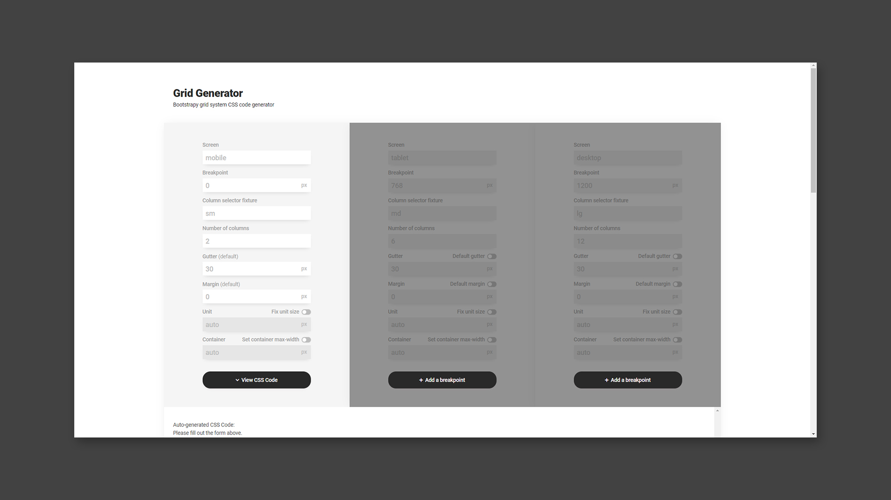
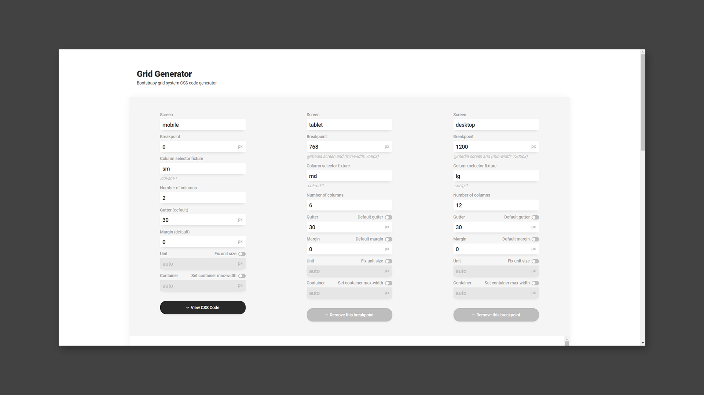
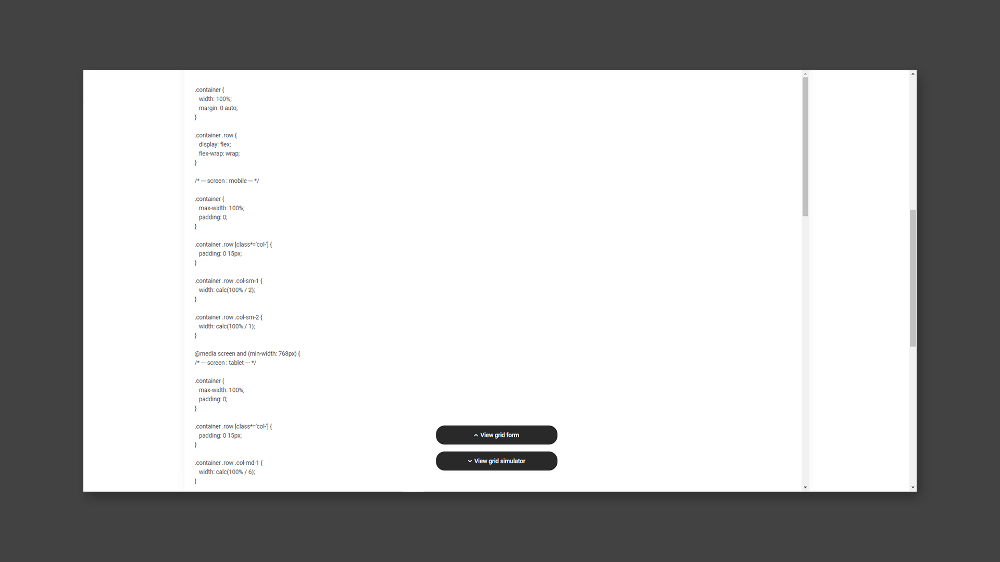
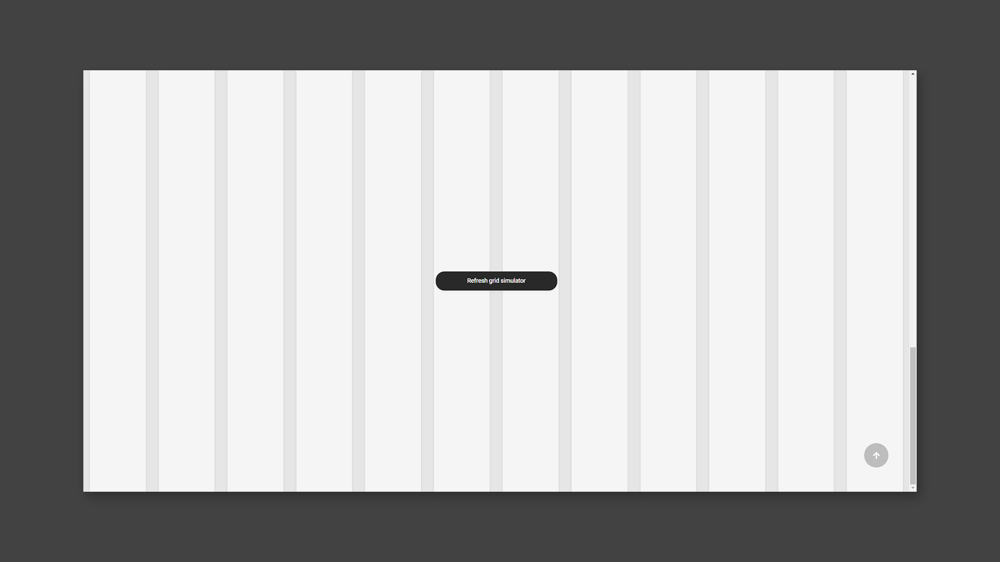

# Grid Generator

 

Bootstrap Grid System을 커스터마이징하여 사용할 수 있는 Grid CSS 코드를 생성하는 프로그램

[> View Live](https://lexie-kaia.github.io/grid-generator/)

 

 
 

## 프로젝트 목표

1. 재사용 가능한 프로그램 개발
2. Vanilla JS의 Class 활용

 
 

## 기술 스택

HTML, CSS, JavaScript

 
 

## 구현 기능

### Must have

- [x] 폼에서 입력 받는 데이터로 Grid CSS 코드 자동 생성
- [x] 생성된 Grid CSS 코드를 화면에 시뮬레이션
- [x] Grid CSS 코드에 Breakpoint를 추가 및 제거(최대 3개 - mobile, tablet, desktop)

 

### Good to have

- [x] 반응형 디자인
- [x] 모바일에서 편의를 위해 화면 이동 버튼 추가

 
 

 
 

## 프로젝트를 하면서 배운점

[> JavaScript - Object, Class, `This` Binding, Prototype, OOP](https://spring-slipper-6a7.notion.site/JavaScript-Object-Class-This-Binding-Prototype-OOP-07177a83888a41ec9e95422fddec50e6)

 
 

## 프로젝트 리뷰

개발 당시에는 JavaScript Class 문법에 익숙하지 않았고, Class encapsulation을 잘 하지 못해 아쉬운 점이 많았습니다. 이 프로젝트 계기로 Object Oriented Programming을 공부하게 되었고, Dependency Injection과 Composition을 이용해 꼬여있는 Class의 관계를 정리하고 싶다는 생각이 들었습니다. 더불어 JavaScript Class보다 확장된 TypeScript의 Class를 알게 되었고 이것을 적용하기 위해 v 2.0을 준비하고 있습니다.

 
